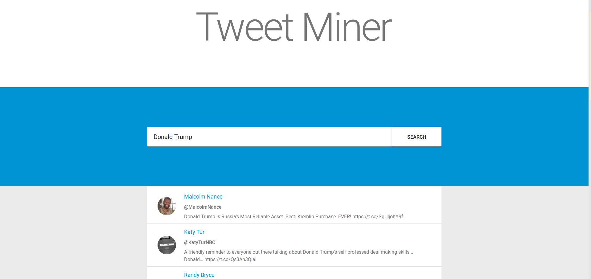

Tweet Miner
===========
Tweet Miner is a server rendered React/NextJS web application that allows a user to
search for Twitter Tweets using keywords.



Configuration
-------------
App specific configuration can be found in next.config.js. One should set the apiUrl property
to the value of the URL where the app will be hosted, or the URL of a load balancer fronting the app.
For testing purposes, localhost is generally fine:

```
module.exports = {
    webpack: (config, {dev}) => {
        if(dev) {
            config.devtool = 'cheap-module-eval-source-map'
        }
        // Fixes npm packages that depend on `fs` module
        config.node = {
            fs: 'empty'
        };

        return config
    },
    publicRuntimeConfig: {
        apiUrl: 'http://localhost:3000'
    }
};

```

Usage
-----
Run
```
npm install
```
to ensure that the node modules are installed. Once that is completed,
run
```
npm build && npm start
```
to run the application in production mode. The app is configured
to run on localhost:3000 by default so navigating to that in the browser
should display the index page.
To run tests, run the command
```
npm test
```
